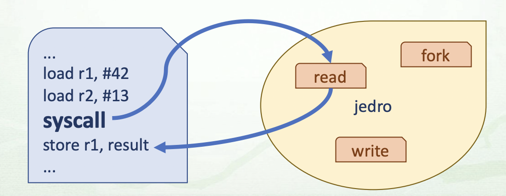

# Sistemski Klici
- `Mehanizem` preko katerega **uporabniski program** zahteva **jedrno storitev**
- Klic **podprograma** v jedru, ki implementira zahtevano storitev

- vsak klic ima svojo `stevilko`
    - npr `exit = 1`
- prejme lahko tudi **argumente**
    - npr exit(32)
- `tabela rokovalnikov` sistemskih klicev
    - stevilka sistemskega klica je enaka indeksu rokovalnika v tabeli
    - 1 ... exit, 2 ... fork, 3 ... read, 4 ... write

## Sistemski vmesnik preklop v jedro
- **namenski strojni ukaz** 
- **programska prekinitev**

## Kako ga izvedemo
1. Priprava na sistemski klic (podajanje st. sistemskega klica in argumentov)
1. Vstop v jedro (preko sistemskega vmesnika, preklop v privilegiran nacin, prozenje rokovalnika)
1. Izvedba rokovalnika sistemskega vmesnika
1. Izvedba rokovalnka sistemskega klica
1. Izstop iz jedra

## Ali je njegova uporba varna

# Ovojne funkcije
- Njen namen je klic druge **funkcije** oz izvedba sistemskega klica
- V standardni knjiznici stdlib.h, stdio.h, unstd.h
- **primer: fork**:
    - knjiznica unistd.h
    - ovojna funkcija `fork()` (uporabniski prostor)
    - sistemski klic stevilka 2
    - rokovalnik sis. klica `sys_fork()` (jedrni prostor)  

# Standardizacija
`POSIX` - standard IEEE 1003

