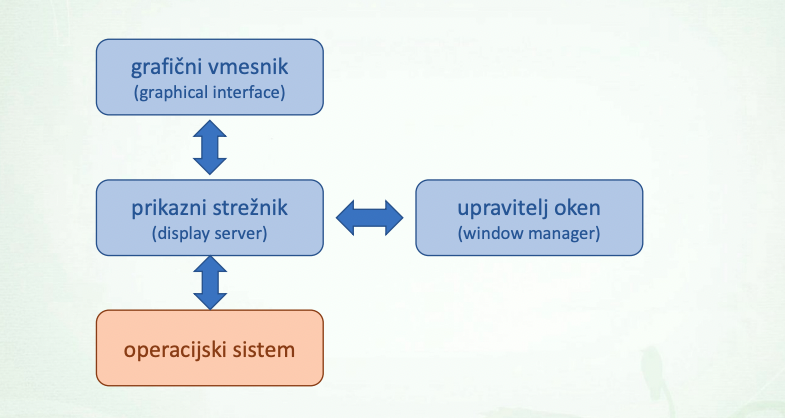

# Racunalniski Sistem
- `strojna oprema (hardware)`: procesor, pomnilnik/predpomnilnink, vhodno izhodne naprave...
- `programska oprema software`: podatki / programi

# Lupina
`Lupina` je **program**, ki nudi osnovni uporabniski **vmesnik** za uporabo in upravljanje **operacijskega sistema**

## Storitve lupine
- upravljanje z datotekami
- upravljanje z procesi
- upravljanje z napravami (strojna oprema)
- upravljanje s programi (programska oprema)
- nadzor in konfiguracija operacijskega sistema

## Vrste lupin
<u>`Graficna lupina`</u>: graficni uporabniski vmesnik, namizno okolje
- preprosta za uprabo (GUI)
- uporaba naprednih vnosnih naprav (tipkovnica, misska, zasloni na dotik, glasovno upravljanje)
- `Graficni vmesnik (graphical interface)`: desktop environment, okna meniji (**graficni elementi**), **interaktivni** elementi (kurzorji, izbire)
- `Prikazni streznik (display server):` komunikacija z aplikacijami po danem **protokolu**, posreduje dogodke na vhodnih napravah aplikaciji
- `Upravitelj oken (window manager)`: nadzoruje postavitev in prikaz oken

    
<u>`Tekstovna lupina`</u>: teskstovni uporabniski vmesnik, ukazna vrstica
- REPL ... read evaluate print loop
- `tekstovni terminal (konzola)`: ukazna lupina tece v terminalu
- `psevdoterminal`: program ki emulira tekstovni terminal - lahko tece v graficnem okolju

## Nacin dela v lupini
- `Interaktivna uporaba`: uporabnik vnese ukaz in zahteva njegovo izvedbo, lupina izvede ukaz in sporoci status izvedbe
- `Neinteraktivna uporaba`
    - minimalna interakcija z uporabnikom
    - izvajanje zaporedja ukazov (zapisanega v skripti)
    - uporabnik zahteva izvedbo skripte -> lupina jo izvede

## Skriptiranje
Izvorna koda v skriptnem programskem jeziku, ki ga podpira lupina oz. operacijski sistem

| **Operacijski sistem** | **Privzeto skriptiranje** |
| - | - | 
| DOS | batch skripta za command.com |
| Windows | batch skripta za cmd.exe ali powershell |
| OS/2, VM/CMS, AmigaOS | Rexx |
| Unix-like OS | bash, sh, zsh, ksh, csh, tcsh in ostali |
| maxOS | Automator: AppleScript, JavaScript, bash/zsh |

