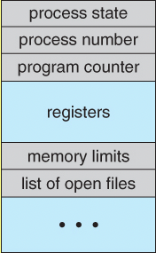

# Process
`Process` is a running program.

# 1. Process api
- Each process has a name: **process ID** `PID`

### Errror handling
- Koda zadnje napake
    - spremenljivka errno
- Izpis obvestila o napaki funkcija `perror()`

```bash
errno -l            # izpise vse kode napak
errno 42            # izpise: ENOMSG 42 No message of desired type
```


### fork() in C
__Fork__ system call is used for __creating a new process__, which is called a __chilled process__

### Info o procesu
- **okolje procesa**
- **env**
```c
#include <stdio.h>
int main(int argc, char* argv[], char* environ[]) {
    // Izpis argumentov.
    int i;
    for (i = 0; i < argc; i++)
        printf("%s\n", argv[i]);
    // Izpis okoljskih spremenljivk.
    i = 0;
    while (environ[i])
       printf("%s\n", environ[i++]);
}
```
- bash
```bash
gcc -o environ environ.c
env -i a=123 b=456 ./environ 1 2 3
env a=123 b=456 ./environ 1 2 3
```
- **info o procesu**
    - PID procesa: `int getpid()`
    - PPID procesa: `int getppid()`
- Razno
    - spanje: `int sleep(unsigned int seconds)`

### Stvaritev procesa
- Sistemski klic `int fork()`
    - ustvari se nov proces (otrok), katerega stars je tekoci proces
    - Otrok je kopija oz. klon starsa
        - kopira se koda, podatki, sklad, rokovalniki signalov, itd.
        - kopirajo se deskriptorji odprtih datotek
        - kljucavnice se ne kopirajo
        - copy-on-write leno kopiranje
```c
int pid = fork();
if (pid < 0)
    // NAPAKA
else if (pid == 0)
    // OTROK
else
    // STARŠ
```


### exec family functions 

- Sistemski klic `int exec(...)`
    - argumenti funkcije
        - pot do izvrslijeve datoteke, argumenti programa
        - lahko podamo tudi okoljske spremenljivke
    - nadomestitev trenutnega procesa
        - PID in PPID se ne spremenita
        - podeduje odprte datoteke, trenutni in korenski imenik
        - zagon izvrsljivke datoteke -> nova koda, sklad, podatki, kopica, ...

- `execl(), execlp(), execle()`
- `execv(), excvp(), execve()`
- koncnice <u>exec</u>
    - `l` (list): podamo arugmente direktno
    - `v` (vector): podamo argumente v tabeli
    - `p` (path) - iskanje preko `$PATH`
    - `e` (environment) - dodajanje okoljskih spremenljivk 

```c
execl("/usr/bin/ls", "/usr/bin/ls", "-alp", "/home/bl4ko", NULL);
execlp("ls", "ls", "-alp", "/home/bl4ko", NULL)

char* args[] = { "ls", "-alp", "/home/jure", NULL };
execvp(argv[1], &argv[1])

char* arr[] = { "ping" , "google.com", NULL }
char* env[] = {"TEST=environment variable", NULL }}
execvpe("ping", arr, env);
```

## Process exit procesa
- sistemski klic `exit(int status)`
    - izhodni status
        - se shrani v jedru v deskriptorju procesa
        - prevzage ga stars procesa z wait()
        - dokler stars ne prevzame statusa je proces zombi
    - proces init kot sirotisnica
        - skrbi za sirote in prevzema njihove izhodne statuse
        - privzeti odziv na `SIGCHLD` je izvedba wait()

### Zombie process
On Unix and Unix-like computer operating systems, a `zombie process` or defunct process 
is a process that has **completed execution** (via the exit system call),
but still has **an entry in the process table**: 
it is a process in the **"Terminated state"**. 
This occurs for the child processes, where the entry is still needed to allow the parent 
process to read its child's exit status: **once the exit status is read**
via the **wait** system call, the zombie's entry is removed from the process table and it is said to be "reaped".

### Orphan process
An `orhpan process` is a computer process whose parent process has finished or terminated,
though it remains running itself.

In Unix-like operating system any orphaned proces will be immediately adopted by special
**init system process**.

### Waiting for process 
- druzina funkcij `int wait(..)`
    - cakanje na otroka, da se konca
    - prevzem njegovega izhodnega statusa
    - cakanje na dolocenega otroka
        - `int waitpid(pid, &status, opcije)`
    - cakanje na poljubnega otroka
        - `int wait(&status)`
        - enako kot `waitpid(-1, &status, 0)`
    - izhodni status se skriva v spremenljivki `status`
    - branje izhodnega statusa
    - man waitpid
    - `makro WIFEEXITED(status)`
         - se je program koncal z exit()?
    - `makro WEXITSTATUS(status)`
        - iz spremenljivke status se izlusci izhodni status

## I/O systemcalls
1. Create a new file
    * int create(char* filename, mode_t mode)
        * mode: indicates permissions of a new file
        * returns: first unused file descriptor or -1 when error 

2. Open the file
    * int open(const char* Path, int flags);
        * O_RDONLY: read only
        * O_WRONLY: write only
        * O_RDWR: read and write
        * O_CREAT: create file if it doesn't exist
        * O_EXCL: prevent creation if it already exist
        * O_TRUNC: truncate regular writable file when opened
        * O_APPEND: append mode
        * https://man7.org/linux/man-pages/man2/open.2.html

3. Close: tellls the operating system you are done with a file descriptor and close the file which pointed by fd.
    * int close(int fd)
    * returns: 0 on success, -1 on error

4. Read: REads cnt bytes of input into the memory area indicated by buf
    * size_t read(int fd, void* buf, size_t cnt)
    * cnt length of the buf
    * return: 
        * return Number of bytes read on success
        * return 0 on reaching end of file
        * reutnr -1 on error
        * return -1 on signal interrupt

5. Write: writes cnt bytes from but to the file
    * size_t write(int fd, void* buf, size_t cnt)
    * return:
        * Number of bytes on success
        * 0 on reaching end of file
        * -1 on error
        * -1 on signal interrupt

- Systemcalls example of `cpcat`

```bash
#include <unistd.h>
#include <errno.h>          // error number: errno 
#include <fcntl.h>          // Flags for open
#include <stdlib.h>
#include <stdio.h>
#include <string.h>
#include "syscall.h"        // BUFSIZ


void cpCat(const char* progName, const char* srcPath, const char* destPath);
void writeErorr(int errNum, const char* progName); 


int main(int argc, char const *argv[]) {
    switch (argc) {
        case 1:
            cpCat(argv[0], "-", "-");
            break;
        case 2:
            cpCat(argv[0], argv[1], "-");
            break;
        case 3:
            cpCat(argv[0], argv[1], argv[2]);
            break;
        default:
            write(2, "Too many arguments given.\n", 26);
            break;
    }
    return 0;
}

void cpCat(const char* progName, const char* srcPath, const char* destPath) {

    // -- 1. Opening files -------------------------------------------
    int srcDesc = strcmp(srcPath, "-") == 0 ? 0 : open(srcPath, O_RDONLY);
    if (srcDesc < 0) 
        writeErorr(errno, srcPath);

    int destDesc = strcmp(destPath, "-") == 0 ? 1 : open(destPath, O_WRONLY);
    if (destDesc < 0) 
        writeErorr(errno, destPath);

    // -- 2. Copying data ---------------------------------------------
    char buff[BUFSIZ];
    int n_read;
    while ((n_read = read(srcDesc, buff, BUFSIZ)) > 0) {
        if (write(destDesc, buff, n_read) < 0) 
            writeErorr(errno, destPath);
        n_read = 0;
    }
    if (n_read < 0) {
        writeErorr(errno, srcPath);
    }
    
    // -- 3. Closing files --------------------------------------------
    if (close(srcDesc) < 0) 
        writeErorr(errno, srcPath);
    
    if (close(destDesc) < 0) 
        writeErorr(errno, destPath);
}

void writeErorr(int errNum, const char* progName) {
    perror(progName);
    exit(errNum);
}
```


# 2. Process states
Processes may be in one of 5 states, as shown in figure below:
- `New`: the process is in the stage of being created
- `Ready`: the process has all the resources available that it needs to run, but the CPU is not currently working on the process's instructions
- `Running`: The PU is working on the process's instructions
- `Waiting`: The process cannot run at this moment, because it is waiting for some resource to become available or for some event to occur.
    - example: waiting for keyboard interrupt, disk access request, a timer go off, inter-process messages...
- `Terminated`: The process has been completed


# 3. Process list
It stores Information about all processes.
Each entry in `PCB`.

## Process Control Block (PCB)
For each process there is a Process Control Block, PCB, which stores the following process-specific information:




| **Field** | **Meaning** |
| - | - |
| `Process State` | Running,waiting, ...(one of above) |
| `PID` and `PPID` | Process and parent ID |
| `CPU registers and Program Counter` | These need to be saved and restored when swapping processes in and out of the CPU |
| `CPU-Scheduling information` | Such as priority information and pointers to scheduling queues |
| `Memory-Managment information` | E.g. page tables or segment tables |
| `Accounting information` | user and kernel CPU time consumed, account numbers, limits, etc |
| `I/O Status information` | Devices allocated, open file tables, etc. |


