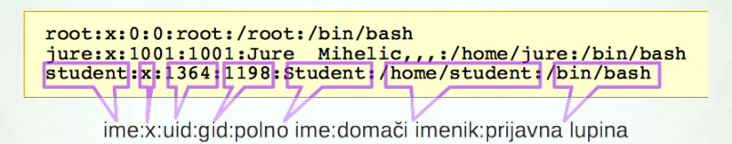
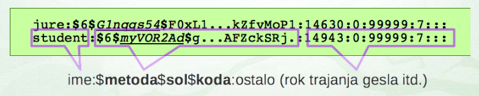
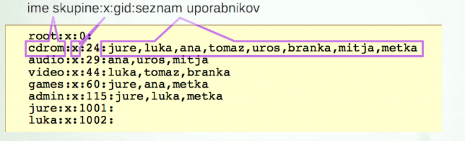

# Varnost in zascita
**Mehanizem** za **nadzor dostopa do virov** 
- programi (oz. uporabniki) uporabljajo vire
- sciti pred nedovoljeno uporabo virov
- razlicne vrste dostoppov(read, write, execute)

Zascita virov s strani OS
- zascita pred mreznim dostopom (pozarni zidovi)
- zascita pred fizicnim dostopom (poseben prostor)
- uporabniska ozavescenost (dobra gesla)

## Nacela nacrtovanja varnosti
> mehanizem zascite mora biti javen (predpostavljanje da napadalec ne pozna mehanizma samo zavaja nacrtovalce)

> privzeto dovoljenje naj bo "ni dostopa"

> sprotno preverjanje dovoljenj: aktualna dovoljenja naj se preverijo ob dejanju

# Uporbniki
**Oseba** ki uporablja racunalniski sistem oz. ima ustvarjen uporabniski racun

### Vrste uporabnikov
- `navadni uporabnik`: za obicajno uporabo
- `administrator, root`: vzdrzevalec sistema, ima vec ali vse pravice
- `superuser, sudoer`: obicajen uporabnik, ki lahko zacasno dvigne svoje pravice
- `gost` anonimen obicajen uporabnik, njegove nastavitve in datoteke se navadno ne hranijo

### Stevilo uporabnikov OS
- **Brezuporabniski-enouporabniski** OS
- **vecuporabniski** OS (razlikovanje in razpoznavanje uporabnikov, lastnistvo virov, nadzor upoarbe virov)

### Uporabniski racun
**Mehanizem** ki omogoca: razlikovanje med uporabniki, prijavo v sistem, locevanje virov med uporabniki
- skuperk podatkov o uporabniku (osebni podatki, podatki za prijavo v sistem, podatki za mehanizem zascite)

### Prijava v sistem
- `identifikacija`: ugotavljanje kdo je dani uporabnik (npr. uporabnisko ime)
- `avtentikacija`: preverjanje istovetnosti danih podatkov, potrjevanje identitete (geslo)

### Nacini avtentikacije
- **pomnenje** dolocenih **podatkov** (gesla, osebni podatki....)
- **fizicne lastnosti** uporabnikov (prstni odtis...)
- **fizicne naprave** (kljuc, pametne kartice, RFID kljuci)

### Nacini dostopa do racunalnika
- **lokalna** prijava / dostop (prijava v lokalni racunalnik ki ga fizicno upoarbljamo)
- **oddaljena** prijava (prijava v oddaljeni racunalnik preko lokalnega (ssh))

## Uporabniki v Linuxu
- datoteka `/etc/passwd` (vse razen podatkov o geslu)

- datoteka `/etc/shadow` (hrani zgoscene vrednosti (hash) gesel) 
    - soljenje gesel:
        - sol: nakljucni niz dodan geslu pred zgoscevanjem
    - namen soljenja:
        - enaki gesli + razlicna sol imata razlicno zgosceno vrednost
        - onemogocanje napada z mavricno tabelo (rainbow table)

- datoteka `/etc/group` hrani seznam uorabniki ki pripadajo skupini
    - gesla v `/etc/shadow`

