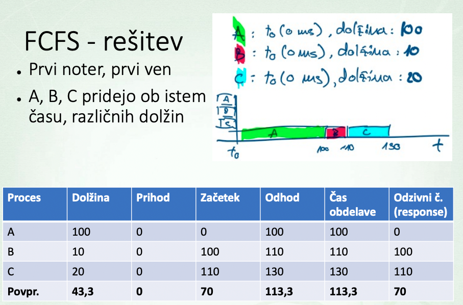
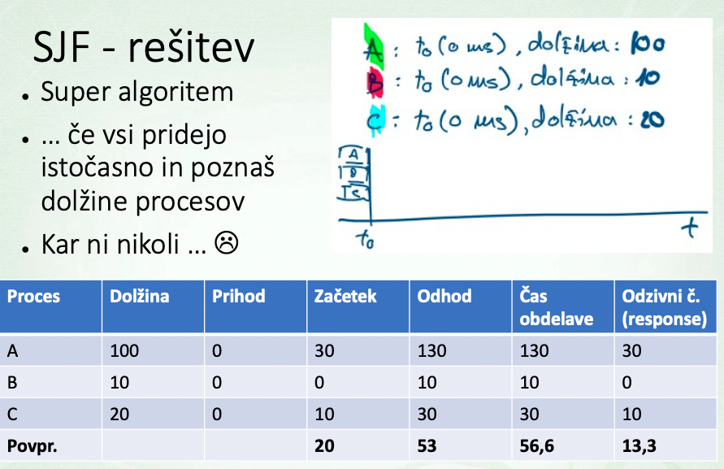
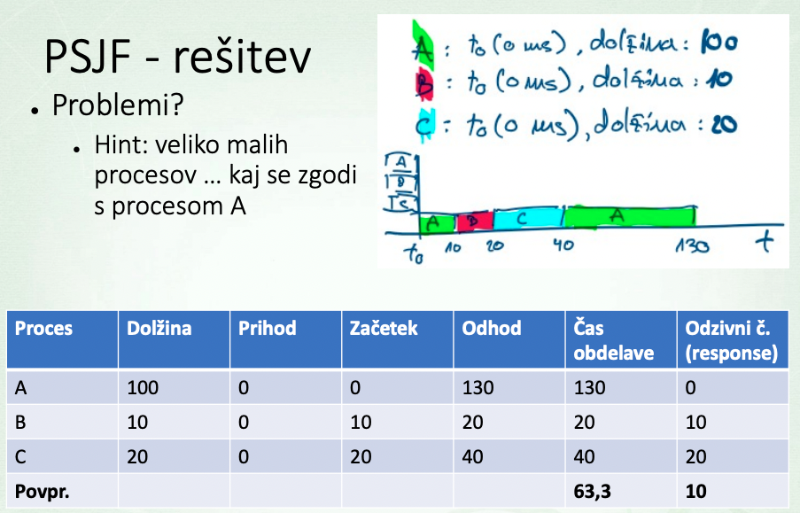
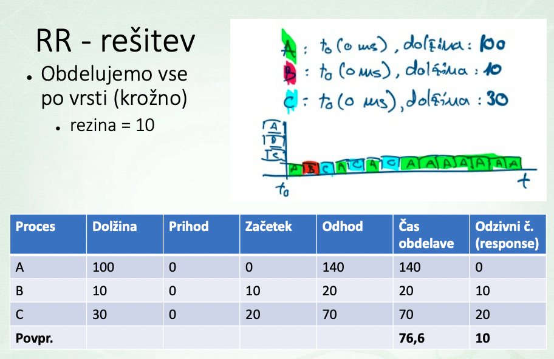
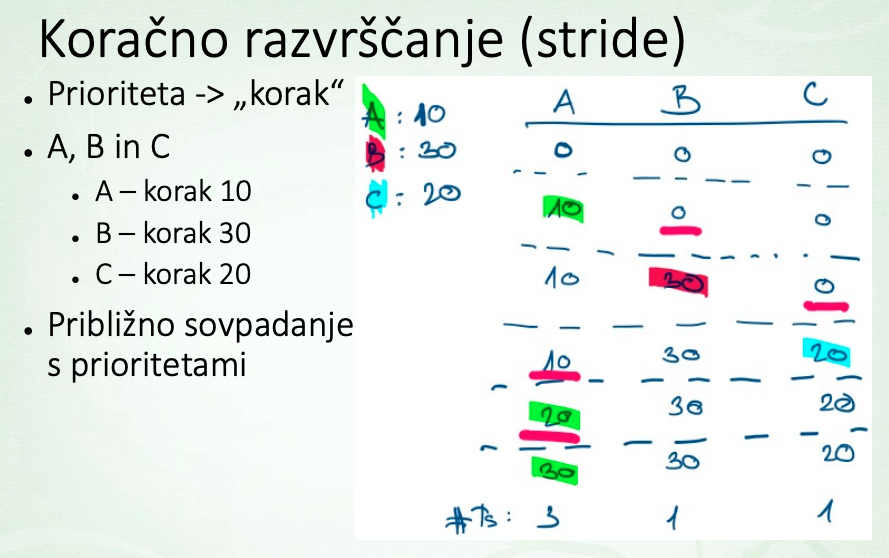

# Simple Scheduling
## 1. FCFS/FIFO

> Problem: **Convoy Effect**: longest comes first

## 2. SJF (Shortest Job First)
- :white_check_mark: Best algorithm when all arive at the same time
- :x: arrivals at different times

## 3. PSJF (Preemptive SJF) 
Always run the job with the **shortest remaining time**, even if this preempts a currently running job.

## 4. Round Robin

## 5. Koracno razvrscanje Stride
Prioriteto nakazemo z dolzino casovne rezine ki jo ima posamezen procees.

> SJF, STCF optimizes **turnaround** time, but is bad for **response** time.

> RR optimizes **response** time, but is bad for **turnaround**

## Problems
Jobs doing **I/O**:
- Process is **blocked** waiting for I/O completition (not using CPE)
- The Scheduler should schedule another job on the CPU at the time

Time of each jobs is **not known**, solution:
- `Multi-level feedback queue`: uses the past to predict the future.
