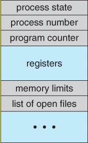

# Process
`Program` is a code stored in executable file.

`Process` is a running program.

## Nalogi procesov
- **lastnistvo/zascita virov** (pomnilnik, V/I naprave, datoteke, itd.)
    - `procesi` so povezani z lastnistvom virov
- **izvajanj kode** (izvajanje kode sledi neki poti preko vec programov)
    - `niti` so povezane z izvajanjem kode

## Sestava procesa
- **programska koda**: koda ki se izvaja na procesorju
- **sklad**: podatki, pomembni za izvajanje
- **kopica**: dinamicno alocirani podatki
- **podatki** ostali podatki ki jih proces obdeluje
- **deskriptor procesa/PCB** dodatni nadzorni podatki, ki jih OS potrebuje za upravljanje procesa


# 2. Process states
Processes may be in one of 5 states, as shown in figure below:
- `New`: the process is in the stage of being created
- `Ready`: the process has all the resources available that it needs to run, but the CPU is not currently working on the process's instructions
- `Running`: The PU is working on the process's instructions
- `Waiting`: The process cannot run at this moment, because it is waiting for some resource to become available or for some event to occur.
    - example: waiting for keyboard interrupt, disk access request, a timer go off, inter-process messages...
- `Terminated`: The process has been completed


# 3. Process list
It stores Information about all processes.
Each entry in `PCB`.

## Process Control Block (PCB)
For each process there is a Process Control Block, PCB, which stores the following process-specific information:




| **Field** | **Meaning** |
| - | - |
| `Process State` | Running,waiting, ...(one of above) |
| `PID` and `PPID` | Process and parent ID |
| `CPU registers and Program Counter` | These need to be saved and restored when swapping processes in and out of the CPU |
| `CPU-Scheduling information` | Such as priority information and pointers to scheduling queues |
| `Memory-Managment information` | E.g. page tables or segment tables |
| `Accounting information` | user and kernel CPU time consumed, account numbers, limits, etc |
| `I/O Status information` | Devices allocated, open file tables, etc. |

## Context switch


---

# 1. Process api
- Each process has a name: **process ID** `PID`

## Process Bash
- `ps` izpis procesov
- `pidof` or `pgrep` izpis PIDa procesa
- `pstree` hiearhija procesov
- `top/htop` interaktiven pogled procesov
- `sleep` spanje
- `wait` cakanje vseh otrok na dokoncanje
    - `wait <PID>` cakanje dolocenega
- `exit status` koncanje procesa
- `kill PID` ukinjanje procesa

### Okolje procesa
- ime ukaza `$1`
- argumenti: `$1, $2..`
- okoljske spremenljivke `env`
- PID lupine: `$$`
- PPID lupine: `$PPID`
- PID procesa `$BASHPID`

```bash
echo $PPID $$ $BASHPID
( echo $PPID $$ $BASHPID )
( ( echo $PPID $$ $BASHPID ) )
```

### Omejitve procesa
- `ulimit`
```bash
ulimit -a
-t: cpu time (seconds)              unlimited
-f: file size (blocks)              unlimited
-d: data seg size (kbytes)          unlimited
-s: stack size (kbytes)             8176
-c: core file size (blocks)         0
-v: address space (kbytes)          unlimited
-l: locked-in-memory size (kbytes)  unlimited
-u: processes                       2666
-n: file descriptors                256
```

### Zagon ukazov v ozadju/odspredju
- **odspredje**: navaden zagon
- **ozadje**: za ukazom dodamo `&`
- podlupina `( ... )`

### Jobs
Zagon v ozadju
```bash
jobs # izpis tekocih poslov
<Ctrl+Z> # Zaustavitev posla v ospredju
fg  # nadaljevanja v ospredu
bg # nadaljevanje v ozadju
disown # locitev posla od lupine
screen # virtualna lupina
```

### Proc dattotecni sistem
- `/proc` psevdo datotecni sistem, dostop do jedra
- `/proc/PID` info o procesu st. PID


## Process C

### Process information
- **Process environment**:
    - arguments `argc, argv`
    - enviromental variables `environ` ukaz env

```bash
gcc -o environ environ.c
env -i a=123 b=456 ./environ 1 2 3
env a=123 b=456 ./environ 1 2 3
```

```c
int main(int argc, char* argv[], char* environ[]) {
    // Izpis argumentov.
    int i;
    for (i = 0; i < argc; i++)
        printf("%s\n", argv[i]);
    // Izpis okoljskih spremenljivk.
    i = 0;
    while (environ[i])
       printf("%s\n", environ[i++]);
}
```

- **info o procesu**
    - PID procesa: `int getpid()`
    - PPID procesa: `int getppid()`
- Razno
    - spanje: `int sleep(unsigned int seconds)`


### Process Creation
- Sistemski klic `int fork()`
    - ustvari se nov proces (otrok), katerega stars je tekoci proces
    - Otrok je kopija oz. klon starsa
        - kopira se **koda**, **podatki**, **sklad**, **rokovalniki signalov**, itd.
        - kopirajo se **deskriptorji odprtih datotek**
        - kljucavnice **se ne kopirajo**
        - copy-on-write leno kopiranje
```c
int pid = fork();
if (pid < 0)
    // NAPAKA
else if (pid == 0)
    // OTROK
else
    // STARŠ
```

### Process exit
- sistemski klic `exit(int status)`
    - izhodni status
        - se shrani v jedru v deskriptorju procesa
        - prevzage ga stars procesa z wait()
        - dokler stars ne prevzame statusa je proces zombi
    - proces init kot sirotisnica
        - skrbi za sirote in prevzema njihove izhodne statuse
        - privzeti odziv na `SIGCHLD` je izvedba wait()

### Waiting for process 
- druzina funkcij `int wait(..)`
    - cakanje na otroka, da se konca
    - prevzem njegovega izhodnega statusa
    - cakanje na dolocenega otroka
        - `int waitpid(pid, &status, opcije)`
    - cakanje na poljubnega otroka
        - `int wait(&status)`
        - enako kot `waitpid(-1, &status, 0)`
    - izhodni status se skriva v spremenljivki `status`
    - branje izhodnega statusa
    - man waitpid
    - `makro WIFEEXITED(status)`
         - se je program koncal z exit()?
    - `makro WEXITSTATUS(status)`
        - iz spremenljivke status se izlusci izhodni status


### exec family functions 
- Sistemski klic `int exec(...)`
    - argumenti funkcije
        - pot do izvrslijeve datoteke, argumenti programa
        - lahko podamo tudi okoljske spremenljivke
    - nadomestitev trenutnega procesa
        - PID in PPID se ne spremenita
        - podeduje odprte datoteke, trenutni in korenski imenik
        - zagon izvrsljivke datoteke -> nova koda, sklad, podatki, kopica, ...

- `execl(), execlp(), execle()`
- `execv(), excvp(), execve()`
- koncnice <u>exec</u>
    - `l` (list): podamo arugmente direktno
    - `v` (vector): podamo argumente v tabeli
    - `p` (path) - iskanje preko `$PATH`
    - `e` (environment) - dodajanje okoljskih spremenljivk 

```c
execl("/usr/bin/ls", "/usr/bin/ls", "-alp", "/home/bl4ko", NULL);
execlp("ls", "ls", "-alp", "/home/bl4ko", NULL)

char* args[] = { "ls", "-alp", "/home/jure", NULL };
execvp(argv[1], &argv[1])

char* arr[] = { "ping" , "google.com", NULL }
char* env[] = {"TEST=environment variable", NULL }}
execvpe("ping", arr, env);
```


### Zombie process
On Unix and Unix-like computer operating systems, a `zombie process` or defunct process 
is a process that has **completed execution** (via the exit system call),
but still has **an entry in the process table**: 
it is a process in the **"Terminated state"**. 
This occurs for the child processes, where the entry is still needed to allow the parent 
process to read its child's exit status: **once the exit status is read**
via the **wait** system call, the zombie's entry is removed from the process table and it is said to be "reaped".

### Orphan process
An `orhpan process` is a computer process whose parent process has finished or terminated,
though it remains running itself.

In Unix-like operating system any orphaned proces will be immediately adopted by special
**init system process**.
