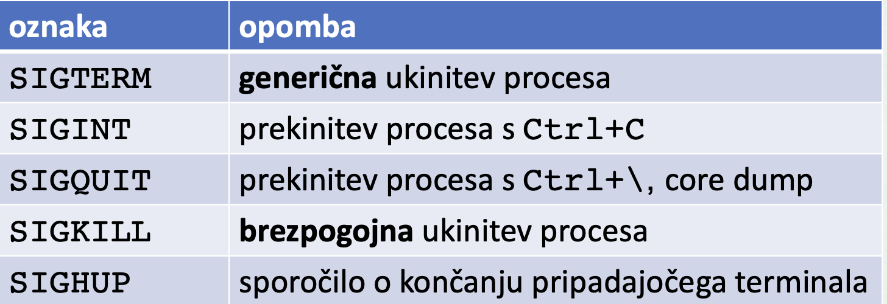
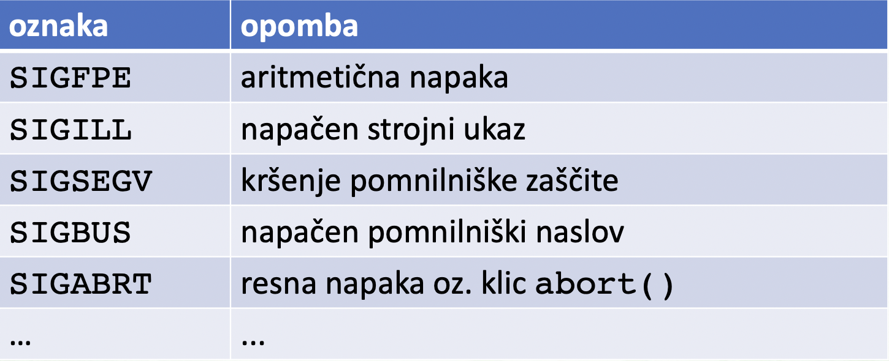

# Signali
`Signal` je programska prekinitev procesa (kratko sporocilo (stevilka signala))

- **izvor** (posiljatelj):
    - jedro OS ali poljuben procees
    - jedro uoprablja signale za sporocanje izjemnih dogodkov

- **ponor** (prejemnik):
    - poljuben proces
    - ciljni proces izovra neposredno nepozna

## Rokovanje signalov
**Rokovanje signalov**:
- vsak signal ima svoj rokovalnik
- odziv na signal, kratka rutina, ki se izvede ob prejetju signala

**Nacini rokovanja**:
- privzeti rokovalnik: `SIG_DFL` (default - poskrbi OS)
- ignoriranje signala: `SIG_IGN` (ignore)
- uporabniski rokovalnik (definiramo sami)

**Mozni privzeti odzivi na signale**:
- koncanje procesa
- koncanje procesa in zapis core datoteke (core dump)
- zaustavitev ali nadaljevanje procesa
- privzeto rokovanje opravi OS

## Vrste signalov
- je podana s __stevilko__ oz __oznako__ signala


#### Ukinjanje procesa
Privzeti odziv je koncnje procesa


#### Programske napake
Privzeti odziv je koncanje procesa in zapis core datoteke


#### Nadzor procesov/poslov


#### Razno
Privzeti odziv je koncanje procesa
| Oznaka | Opomba |
| - | - | 
| `SIGUSR1` | prvi uporabniski signal |
| `SIGUSR2` | drugi uporabniski signal |


## Bash
<u>Posiljanje signalov</u>: ukaz `kill`

```bash
kill -l                         # list signalov
kill -l 5                       # pove ime signala
kill -l TRAP                    # cifra signala
kill -SIGUSR1 123 456 789       # koncamo procese 
kill -0 $$; echo $?             # ali procees obstaja
kill -CONT -1                   #
```
<u>Lovljenje signalov</u>: ukaz `trap`
```bash
trap -p
trap "ls" SIGUSR1
trap "echo Zivjo" 2         # Izpisi zivjo ob CTRL+C
trap -p SIGINT
trap "" 2                   #
trap - INT                  # Poenostavi
```

## C
**Otrok** deduje rokovalnike starsa 

**Nov program** ima privzete rokovalnike
    - sistemski klic `exec()` izgubi rokovalnike

### Posiljanje signala
```c
// Posiljanje signala signum procesu pid
kill(pid, signum);

// Posiljanje signala samemu sebi
raise(signum)
```

Uporabniski rokovalnik
- sistemski klic `signal(signum, sigfun)`
- ob prejetu signala `signum` se poklice funkcija `sigfun`
- podpis rokovalne funkcije

### Handlanje signala
```c
// Rokovalnik koncanih otrok
void sigchld_handler (int signum) {
    int pid, status, serrno;
    serrno = errno;
    while (1) {
        pid = waitpid(WAIT_ANY, &status, WNOHANG);
    if (pid < 0) {
        perror ("waitpid");
        break;
    }
    if (pid == 0) break;
        notice_termination (pid, status);
    }
    errno = serrno;
}

...
signal(SIGCHLD, sigchld_handler);
... 
```

