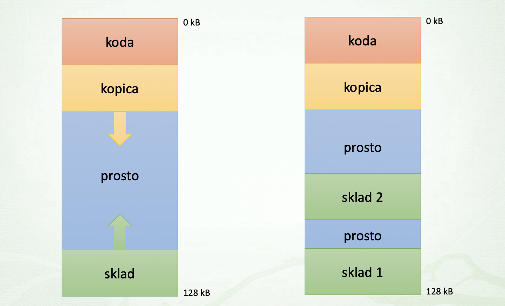

# Threads
`Process`: program, ki je zagnan v operacijskem sistemu
- vsebuje programsko kodo
- ima svoj address space in druge vire

`Thread`:  part of a process (part of code = instructions)
- zaporedje ukazov, ki se izvajajo na procesorju
- vsebuje del programske kode
- Vse niti se izvajajo "vzporedno"
- all threads <kbd>share same address space</kbd> (file handlers, all the system resources)
    - but each threads has its own stack

### Threads <u>advantages</u> over multi-processes
- **creating** and **destorying** thread is **faster**
    - no initalisation of address space
- switching between threads is faster
    - only registers and stack have to be changed
    - we don't have to change address space
    - no need to empty **TLB** (Translation Lookaside Buffer)
- faster inter-process communication
    - they share memory (they see what each write)

### Threads <u>disadvantages</u>
- <b>critical sections</b>

### Kernel vs User thread
`User thread` is one that executes user-space code. But it can call into kernel space at any time. It's still considered a "User" thread, even though it's executing kernel code at elevated security levels. 

`Kernel thread` is one that only runs kernel code and isn't associated with a user-space process.
