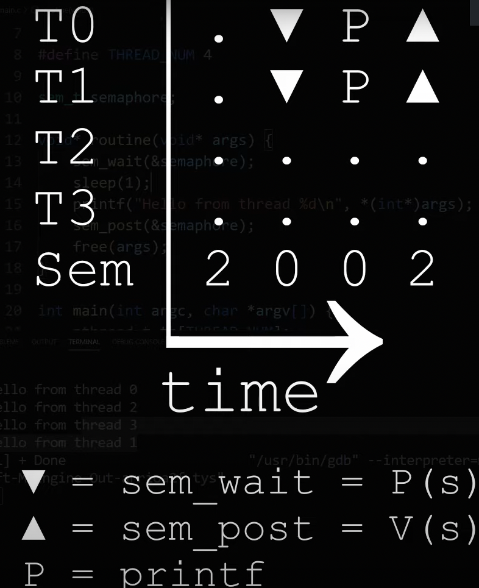

## Intro
- `sem_wait()` checks a **semaphore value**, if a value is 0 then the thread waits for that semaphore
    - if it is higher then 0 then it only decrements it

```txt 
            ------> wait     (s==0)
           /
sem_wait --
           \
            ------> s--      (s>0)

```

- `sem_post()` does a reverse, increases the semaphore value:
```txt 
sem_post ---> s++
```

- `sem_init(&semaphore, 0, 1)` inits semaphore value s = 1 (at value = 1 it is same as mutex)


- if we set `sem_Init(&semaphore, 0, 2)` then two threads will be able to reach critical section at the same time.



## Producer consumer Problem
We have a shared buffer (between multiple threads).
- we have **producers** that put to the buffer
- we have **consumeers** that take fro mthe buffer
```txt
                 __________
                |          |
Producers --->  |  BUFFER  | ----> Consumers
                |__________|

```
Challanges:
- 1) Manage shared memory access
- 2) Checking for if buffer is full
- 3) Checking for if buffer is empty
