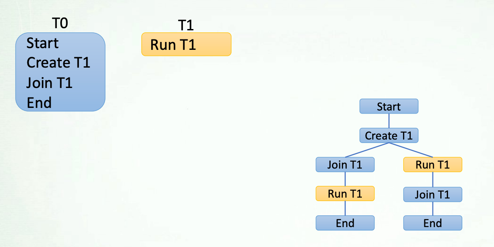
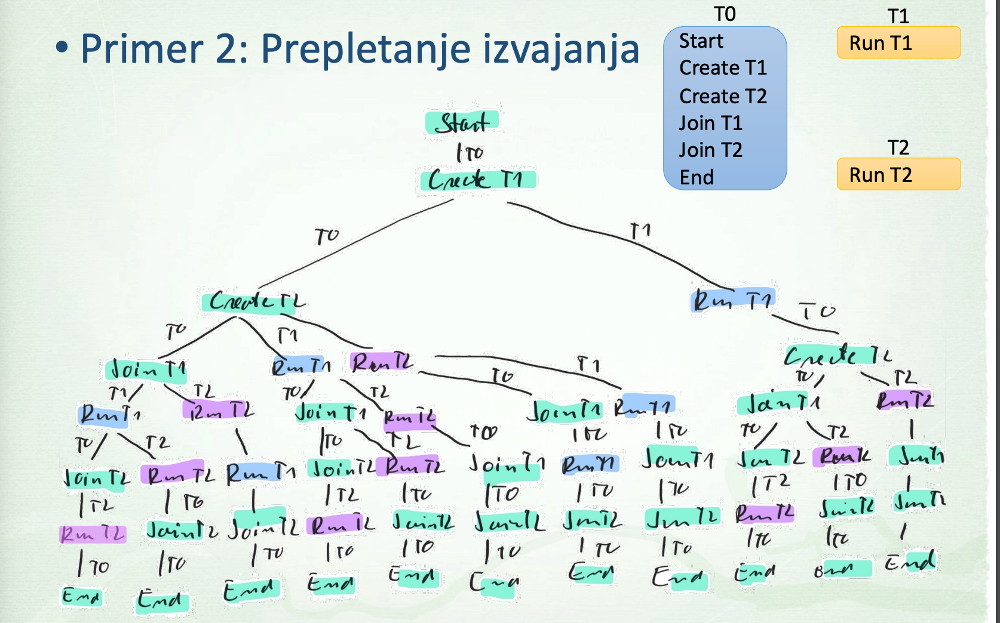
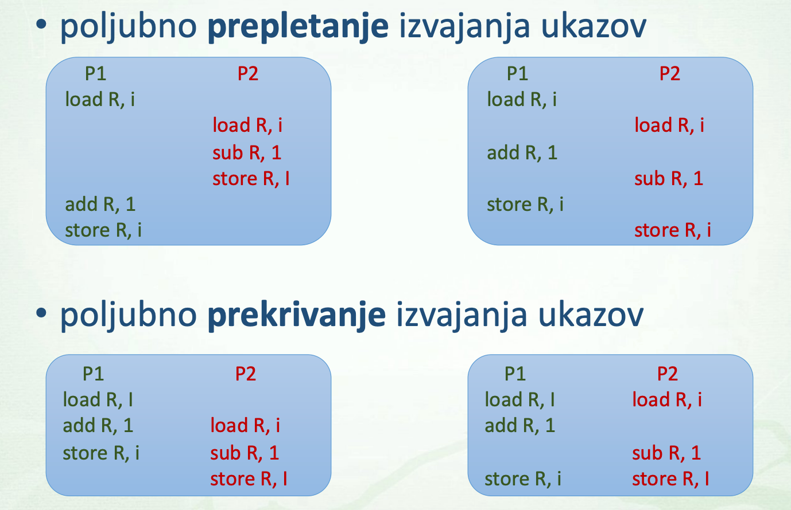

# Socasnost

## Socasnost
`Socasnost/Concurrency`: obcutek hkratnega izvajanja (menjavanje stanja)
- socasnost/brez vzporednosti (1 procesor menjava procesov)
- socasnost z vzporednostjo (vec-procesorski sistem, prekrivanje ukazov)

`Vzporednost/Parallelism`: **dejansko hkratno izvajanje (vec procesorjev)**
- **vzporednost brez socasnosti** (vektorski ukazi, vsak procesor del ukaza)

`Porazdeljenost`: izvajanje vec procesov v vec vozliscih omrezja

> Problem: deljenje globalnih virov, [deadlock](https://en.wikipedia.org/wiki/Deadlock), tezavno odkrivanje prog napak

>  

## Socasno izvajanje ukazov
- `Prepletanje izvajanja`
    - en procesor, vec procesov -> posamezni ukazi razlicnih procesov se poljubno prepletajo
    - slika: 1 pot ena moznost izvajanja

- `Prekiravnje izvajanja`
    - vec procesorjev, vec procesov -> izvedba ukazov razlicnih procesov se poljubno prekriva

## Souporaba vira problem

> Levo zgoraj vrednost i=1

> Desno zgoraj i=-1

> Levo spodaj vrednost i=-1

> Desno spodaj odvisno od arhitekture i=?

## Tvegano stanje
`Race condition`: rezultat odvisen od prepletanja/prekrivanja izvajanja ukazov
- popolnoma nezazeljena lastnost

> Lahko ostane neopazno tudi pri testiranju, izvajanje na razlicnih arhitekturah lahko razlicno pogosto vodi v tvegano stanje

## Kriticni odsek
`Critical section` - **del programske kode** (v katerem je tezava), ki uporablja skupni vir.
- socasna uporaba skupnega vira vodi v tvegano stanje

**Ideja oz resitev**: le en proces naj bo socasno v kriticnem odsekuK
- `princip vzajemnega izkljucevanja`
- program iz socasnega spremenimo v nesocasnega

### Vzajemno izkljuceanje
- **vstop** v kriticni odsek mozen le, ce noben drug proces ni v kriticnem odseku

[reade](https://www.geeksforgeeks.org/g-fact-70/)

> Tezava: 

> Tezava: deadlock

### Deadlock
[readme](https://www.geeksforgeeks.org/introduction-of-deadlock-in-operating-system/)
