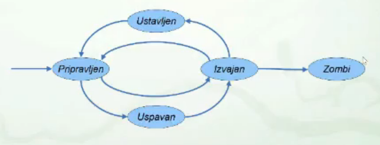
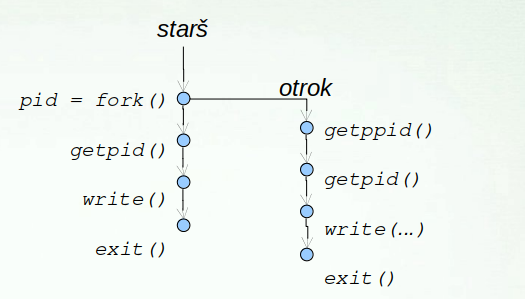
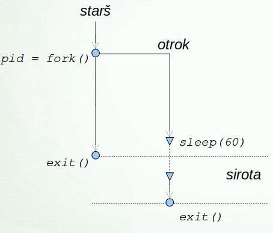
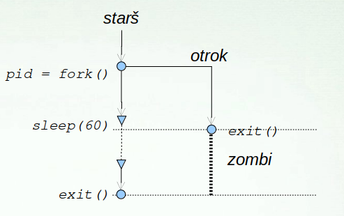
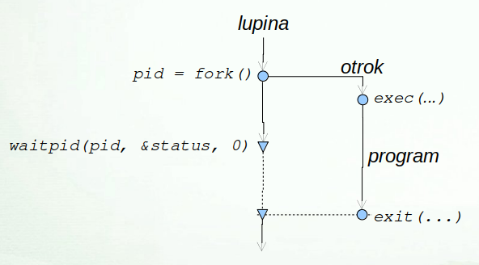
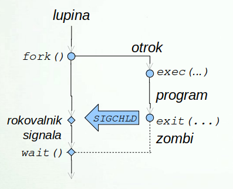
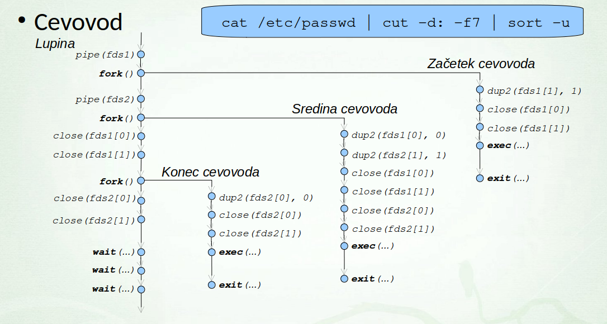

# Sistemski klici

### Obdelava napak
- Koda zadnje napake
    - spremenljivka errno
- Izpis obvestila o napaki funkcija `perror()`

```bash
errno -l            # izpise vse kode napak
errno 42            # izpise: ENOMSG 42 No message of desired type
```
### System functions 

1. Create a new file
    * int create(char* filename, mode_t mode)
        * mode: indicates permissions of a new file
        * returns: first unused file descriptor or -1 when error 

2. Open the file
    * int open(const char* Path, int flags);
        * O_RDONLY: read only
        * O_WRONLY: write only
        * O_RDWR: read and write
        * O_CREAT: create file if it doesn't exist
        * O_EXCL: prevent creation if it already exist
        * O_TRUNC: truncate regular writable file when opened
        * O_APPEND: append mode
        * https://man7.org/linux/man-pages/man2/open.2.html

3. Close: tellls the operating system you are done with a file descriptor and close the file which pointed by fd.
    * int close(int fd)
    * returns: 0 on success, -1 on error

4. Read: REads cnt bytes of input into the memory area indicated by buf
    * size_t read(int fd, void* buf, size_t cnt)
    * cnt length of the buf
    * return: 
        * return Number of bytes read on success
        * return 0 on reaching end of file
        * reutnr -1 on error
        * return -1 on signal interrupt

5. Write: writes cnt bytes from but to the file
    * size_t write(int fd, void* buf, size_t cnt)
    * return:
        * Number of bytes on success
        * 0 on reaching end of file
        * -1 on error
        * -1 on signal interrupt

```c
#include <unistd.h>
#include <errno.h>          // error number: errno 
#include <fcntl.h>          // Flags for open
#include <stdlib.h>
#include <stdio.h>
#include <string.h>
#include "syscall.h"        // BUFSIZ


void cpCat(const char* progName, const char* srcPath, const char* destPath);
void writeErorr(int errNum, const char* progName); 


int main(int argc, char const *argv[]) {
    switch (argc) {
        case 1:
            cpCat(argv[0], "-", "-");
            break;
        case 2:
            cpCat(argv[0], argv[1], "-");
            break;
        case 3:
            cpCat(argv[0], argv[1], argv[2]);
            break;
        default:
            write(2, "Too many arguments given.\n", 26);
            break;
    }
    return 0;
}

void cpCat(const char* progName, const char* srcPath, const char* destPath) {
    int srcDesc = strcmp(srcPath, "-") == 0 ? 0 : open(srcPath, O_RDONLY);
    if (srcDesc < 0) 
        writeErorr(errno, srcPath);

    int destDesc = strcmp(destPath, "-") == 0 ? 1 : open(destPath, O_WRONLY);
    if (destDesc < 0) 
        writeErorr(errno, destPath);
    
    // prepis
    char buff[BUFSIZ];
    int n_read;
    while ((n_read = read(srcDesc, buff, BUFSIZ)) > 0) {
        if (write(destDesc, buff, n_read) < 0) 
            writeErorr(errno, destPath);
        n_read = 0;
    }
    if (n_read < 0) {
        writeErorr(errno, srcPath);
    }

    if (close(srcDesc) < 0) 
        writeErorr(errno, srcPath);
    
    if (close(destDesc) < 0) 
        writeErorr(errno, destPath);
}

void writeErorr(int errNum, const char* progName) {
    perror(progName);
    exit(errNum);
}
```


### syscall()
But what is the function `write` doing? Going one level deeper, we can call the `syscall` function with the same arguments, plus the argument SYS_write specifying the system call number:

```c
#include <unistd.h>
#include <sys/syscall.h>
int main(void) {
  syscall(SYS_write, 1, "hello, world!\n", 14);
  return 0;
}
```

### fork() in C
__Fork__ system call is used for __creating a new process__, which is called a __chilled process__
- `fork()`
  - returns negative value: creation of a child process was unsuccessful
  - returns 0: REturned to the newly created child process
  - positive value: The value contains process ID of newly created child process
```c
#include<stdio.h>
#include <sys/types.h>
#include <unistd.h>

int main() {
    fork()
    printf("hello world!\n");
    return 0;
}
/* Output
* Hello world!
* Hello world!
*/

/* If we use 3 forks
* The main Process: P0
* Process created by the 1st fork: P1
* Proces created by the 2nd fork: P2, P3
* Process created by the 3rd fork: P4, P5, P6, P7
             P0
         /   |   \
       P1    P4   P2
      /  \          \
    P3    P6         P5
   /
 P7
/*
```
- Running parent and child in the same program (each one has own data and states)
```c
#include <stdio.h>
#include <sys/types.h>
#include <unistd.h>
  
void forkexample()
{
    int x = 1;
  
    if (fork() == 0)
        printf("Child has x = %d\n", ++x);
    else
        printf("Parent has x = %d\n", --x);
}
int main()
{
    forkexample();
    return 0;
}
/* Program returns either
Parent has x = 0
Child has x = 2
     (or)
Child has x = 2
Parent has x = 0
```


### execvp
- execvp() is vy usefufl if you want to run another program using our C program
```c
#include <unistd.h>
int execvp(const char* command, char* argv[]);
```
- Here we, refer to a "command" as any binary executable file that is part of the `PATH` environment variable.
    - so if you want to run custom programs make sure that you add it to your `PATH` variable
- `argv`: represents the list of arguuments to command
```c
char* argument_list[] = {"ls", "-l", NULL}; // NULL terminated array of char* strings
 
// Ok! Will execute the command "ls -l"
execvp("ls", argument_list);
```

#### Combinig with fork()
- So anything that comes after `execvp()` will not execute since our program is taken over completely
- However if the command fails for some reason, `execvp()` will return -1
- So whenewever you use `execvp()`, if you want to maintain your C program, you genereally use `fork()` to first spawn 
a new process, and then use `execvp()` on that process
```c
#include <stdio.h>
#include <unistd.h>
 
int main() {
    char* command = "ls";
    char* argument_list[] = {"ls", "-l", NULL};
 
    printf("Before calling execvp()\n");
 
    printf("Creating another process using fork()...\n");
 
    if (fork() == 0) {
        // Newly spawned child Process. This will be taken over by "ls -l"
        int status_code = execvp(command, argument_list);
 
        printf("ls -l has taken control of this child process. This won't execute unless it terminates abnormally!\n");
 
        if (status_code == -1) {
            printf("Terminated Incorrectly\n");
            return 1;
        }
    }
    else {
        // Old Parent process. The C program will come here
        printf("This line will be printed\n");
    }
 
    return 0;
}
```

# Procesi v C

## Stanje procesa
- Linux stanja
    - pripravljen ali izvajan - `TASK_RUNNING`
        - z uporabniskega vidika se proces v obeh primerih izvaja
    - ustavljen - `TASK_STOPPED`
    - uspavan - `TASK_INTERRUPTIBLE, TASK_UNINTERRUPTIBLE`,
    - zombi

<p align="center"></p>


## Info o procesu
- **okolje procesa**
- **env**
```c
#include <stdio.h>
int main(int argc, char* argv[], char* environ[]) {
    // Izpis argumentov.
    int i;
    for (i = 0; i < argc; i++)
        printf("%s\n", argv[i]);
    // Izpis okoljskih spremenljivk.
    i = 0;
    while (environ[i])
       printf("%s\n", environ[i++]);
}
```
- bash
```bash
gcc -o environ environ.c
env -i a=123 b=456 ./environ 1 2 3
env a=123 b=456 ./environ 1 2 3
```
- **info o procesu**
    - PID procesa: `int getpid()`
    - PPID procesa: `int getppid()`
- Razno
    - spanje: `int sleep(unsigned int seconds)`

## Stvaritev procesa
- Sistemski klic `int fork()`
    - ustvari se nov proces (otrok), katerega stars je tekoci proces
    - Otrok je kopija oz. klon starsa
        - kopira se koda, podatki, sklad, rokovalniki signalov, itd.
        - kopirajo se deskriptorji odprtih datotek
        - kljucavnice se ne kopirajo
        - copy-on-write leno kopiranje
```c
int pid = fork();
if (pid < 0)
    // NAPAKA
else if (pid == 0)
    // OTROK
else
    // STARŠ
```

- Sistemski klic `int exec(...)`
    - argumenti funkcije
        - pot do izvrslijeve datoteke, argumenti programa
        - lahko podamo tudi okoljske spremenljivke
    - nadomestitev trenutnega procesa
        - PID in PPID se ne spremenita
        - podeduje odprte datoteke, trenutni in korenski imenik
        - zagon izvrsljivke datoteke -> nova koda, sklad, podatki, kopica, ...

### Druzina funkcij int exec(...)
- `execl(), execlp(), execle()`
- `execv(), excvp(), execve()`
- argumenti ukaza
    - `l`: podamo arugmente direktno
    - `v`: podamo argumente v tabeli
- `p` - iskanje preko `$PATH`
- `e` - dodajanje okoljskih spremenljivk 

```bash
execl("/bin/ls", "ls", "-alp", "/home/jure", NULL);

char* args[] = { "ls", "-alp", "/home/jure", NULL };
execvp("ls", args);

execvp(argv[1], &argv[1])
```

## Koncanje procesa
- sistemski klic `exit(int status)`
    - izhodni status
        - se shrani v jedru v deskriptorju procesa
        - prevzage ga stars procesa z wait()
        - dokler stars ne prevzame statusa je proces zombi
    - proces init kot sirotisnica
        - skrbi za sirote in prevzema njihove izhodne statuse
        - privzeti odziv na `SIGCHLD` je izvedba wait()

## Cakanje na proces
- druzina funkcij `int wait(..)`
    - cakanje na otroka, da se konca
    - prevzem njegovega izhodnega statusa
    - cakanje na dolocenega otroka
        - `int waitpid(pid, &status, opcije)`
    - cakanje na poljubnega otroka
        - `int wait(&status)`
        - enako kot `waitpid(-1, &status, 0)`
    - izhodni status se skriva v spremenljivki `status`
    - branje izhodnega statusa
    - man waitpid
    - `makro WIFEEXITED(status)`
         - se je program koncal z exit()?
    - `makro WEXITSTATUS(status)`
        - iz spremenljivke status se izlusci izhodni status

```c
if (WIFEXITED(status))
    status = WEXITSTATUS(status));
```

## Vejitev
```c
#include <stdio.h>

int main(int argc, char* argv[]) {
    int pid = fork();
    if (pid < 0)
        perror(argv[0]);
    else if (pid == 0)
        printf("Sem otrok %i s staršem %i.\n", getpid(), getppid());
    else
        printf("Sem starš %i z otrokom %i,\n", getpid(), pid);
}
```

<p align="center"></p>

### Primer sirota
```c
#include <stdio.h>

int main(int argc, char* argv[]) {
    int pid = fork();
    if (pid < 0)
        perror(argv[0]);
    else if (pid == 0)
		// otrok zaspi za 60 sekund
        sleep(60);
}
```

<p align="center"></p>


### Primer zombi
```c
#include <stdio.h>

int main(int argc, char* argv[]) {
    int pid = fork();
    if (pid < 0)
        perror(argv[0]);
    else if (pid > 0)
		// starš zaspi za 60 sekund
        sleep(60);
}
```

<p align="center"></p>

### Zagon programa
- ce se exec izvede pravilno se koda nikoli vec ne izvaja naprej
```c
#include <stdlib.h>
#include <stdio.h>
#include <sys/wait.h>

int main(int argc, char* argv[]) {
    int pid = fork();
    if (pid < 0) {
        perror("fork");
        exit(EXIT_FAILURE);
    } else if (pid == 0) {
        execvp(argv[1], &argv[1]);
        perror("exec");
        exit(EXIT_FAILURE);
    } else {
        int status;
        if (waitpid(pid, &status, 0) < 0) {
           perror("waitpid");
           exit(EXIT_FAILURE);
        }
        if (WIFEXITED(status))
           printf("Izhodni status otroka: %i\n",
               WEXITSTATUS(status));
    }
    exit(EXIT_SUCCESS);
}
```

## Procesi v lupini
- `ls`
<p align="center"></p>

- `eyes &`
<p align="center"></p>

- `cat/etc/passwd/ | cut -d: -f7 | sort -u`

<p align="center"></p>

    


