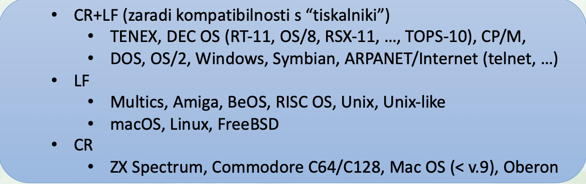
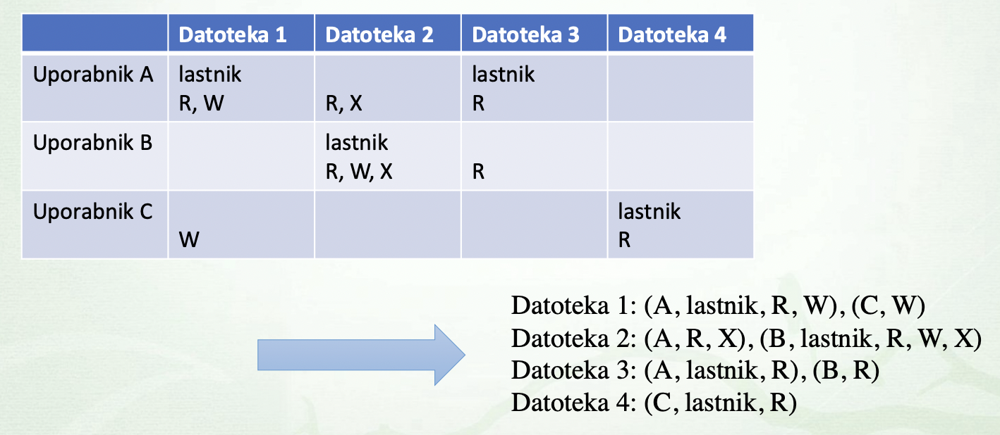
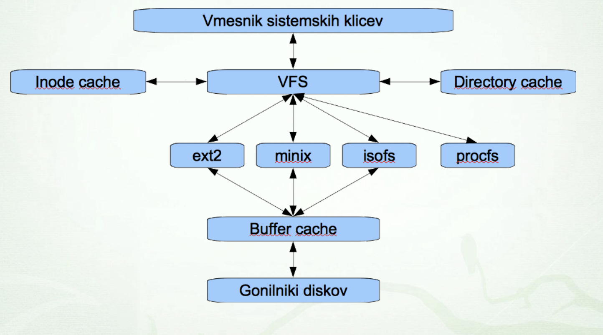

# Logicna organizacija podatkov


### Naslavljanje datotek
- `pot`
- `absolutna pot`
- `relativna pot`

### Datoteke
- abstrakcija datoteke
    - razlicni __tipi datotek__

| oznaka | opis | primer |
| - | - | - |
| `d` | directory | /etc/passwd |
| `s` | simbolicna povezava | /usr/src/linux |
| `b` | block special device | /dev/sda |  
| `c` | znakovno orientirana naprava (character special device) | /dev/tty |
| `p` |  poimenovana cev (named pipe) | |
| `s` | vticnica (socket) | | 

#### Navadna datoteka
- __binarne__ in __tekstovne__ datoteke

#### Imenik 
- njena vsebina je seznam __imeniskih vnosov__

#### Trda povezava
- dodaten imeniski vnos (za isto datoteko)

```bash
ln original trda
```


### Simbolicna mehka povezava

```bash
ln -s original mehka
```


#### Blocna in znakovna povezava
- dva posebna tipa datotek
    - __blocne naprave__
        - dostop po blokih
    - __znakovne naprave__ 
        - dostop po znakih oz. bajtih

#### Cev (pipe), Vticnica (socket)
- mehanizem za medprocesno komunikacijo
- __imenovana cev__ (named pipe)
- __lokalna vticnica__ (local socket)

####

## Kodiranje datotek

### ASCII
- 7 bitno kodiranje:
- razsiritve ASCII __8 bitov__
    - ISO-IEC 8859-1 (Latin 1)
    - ISO-IEC 8859-2 (Latin 2)


### UNICODE
- __21 bitni__ kodirni prostor
    - kodne tocke od U+0000 - U+10FFFF
- kodirni znaki
    - opisuje 143859 znakov
    - prvih 256 znako identicnih ISO-IEC 8859-1

### Razlicna kodiranja

- __UTF-32__
    - prostorsko neucinkovit zelo redka uporaba
- __UTF-16__
    - uporaba znotraj Windows, JVM, macOS...
- __UTF-8__
    - Unix-like sistemi, svetnovni splet

#### UTF-8
- Razsirjen ASCII se ujema v prvih 128 znakih

### Skok v novo vrstico
- `LF`: line feed (naslednja vrstica)
- `CR`: skok na zacetek vrstice  




## Nadzor dostopa
- doloca __kdo__ lahko __kaj__ pocne __s cim__
- __Matrika dostopa__



### Zascita datotek
- vrste dovoljenj
    - `r` - read, `w` - write
    - `x` - execute, `-` - prazno
- sklopi uporabnikov
    - `u` - user, `g` - group 
    - `o` - other, `a` - all


# Navidezni datotecni sistemi

## Imeniska struktura
- razlicni pristopi

### Imeniska struktura
- locevanje med datotekami razlicnih naprav
    - __vec locenih__ imeniskih sturkutr
        - Windows
    - __ena enotna__ imeniska struktura
        - Linux, Unix, macOS

#### Vec imeniskih naprav
- crkovne oznake naprav (diskretni enoti A:, B:), (diskovne enote: C:, D:)
- vsaki oznaki ustreza imeniska struktura napravbe

#### Enotna imeniska struktura
- __korenski datotetcni sistem__


## Pripenjanje naprav
- montiranje, mount
- pripenjanje dodatnega datotecnega sistema danega pomnilniega medija v obstojeco imenisko strukturo
- __tock pripenjanja__ (mount point)
    - tocka pripenjanje se __prekrije__ s okrenski imenikom
    - ukaza `mount` in `unmount`

## Navidezni datotecni sistem
- VFS struktura



- __superblock__
    - naprava kjer se nahaja datotecni sistem
- __inode__ (index node)
- __dentry__ (directory entry)

## Datotecni deskriptorji
- `file`: predstavlja odprto datoteko 
    - kazalec na ustrezen dentry
    - uid in gid proces ki je odprl datoteko

### Dupliciranje deskriptorja

