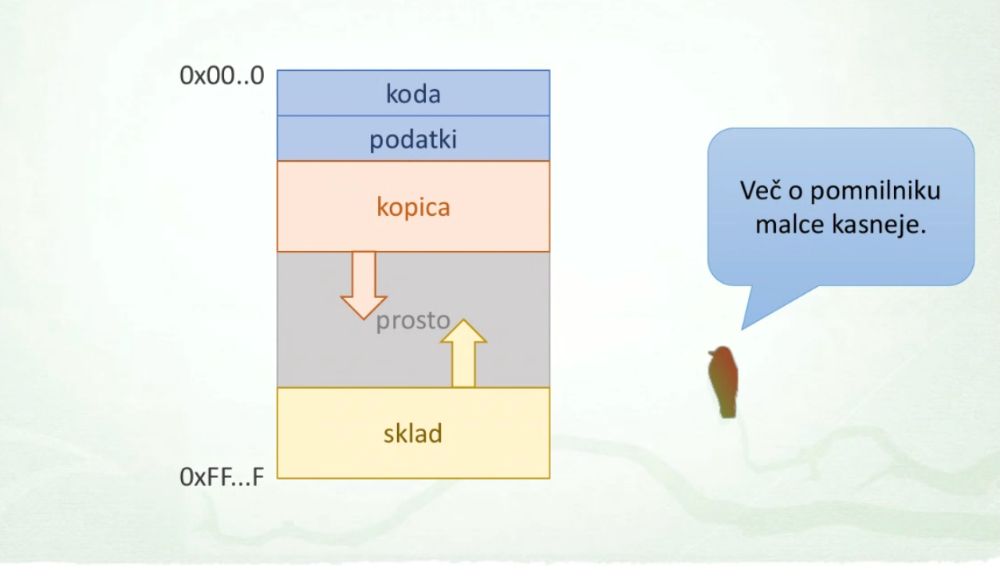
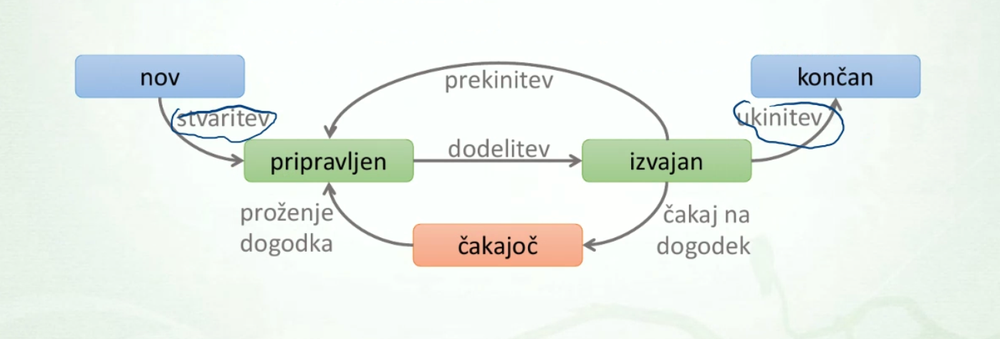

# Logicna organizacija podatkov
### Naslavljanje datotek
- `pot`
- `absolutna pot`
- `relativna pot`

### Datoteke
- abstrakcija datoteke
    - razlicni __tipi datotek__

| oznaka | opis | primer |
| - | - | - |
| `d` | directory | /etc/passwd |
| `s` | simbolicna povezava | /usr/src/linux |
| `b` | block special device | /dev/sda |  
| `c` | znakovno orientirana naprava (character special device) | /dev/tty |
| `p` |  poimenovana cev (named pipe) | |
| `s` | vticnica (socket) | | 

#### Navadna datoteka
- __binarne__ in __tekstovne__ datoteke

#### Imenik 
- njena vsebina je seznam __imeniskih vnosov__

#### Trda povezava
- dodaten imeniski vnos (za isto datoteko)

```bash
ln original trda
```


### Simbolicna mehka povezava

```bash
ln -s original mehka
```


#### Blocna in znakovna povezava
- dva posebna tipa datotek
    - __blocne naprave__
        - dostop po blokih
    - __znakovne naprave__ 
        - dostop po znakih oz. bajtih

#### Cev (pipe), Vticnica (socket)
- mehanizem za medprocesno komunikacijo
- __imenovana cev__ (named pipe)
- __lokalna vticnica__ (local socket)

####

## Kodiranje datotek

### ASCII
- 7 bitno kodiranje:
- razsiritve ASCII __8 bitov__
    - ISO-IEC 8859-1 (Latin 1)
    - ISO-IEC 8859-2 (Latin 2)


### UNICODE
- __21 bitni__ kodirni prostor
    - kodne tocke od U+0000 - U+10FFFF
- kodirni znaki
    - opisuje 143859 znakov
    - prvih 256 znako identicnih ISO-IEC 8859-1

### Razlicna kodiranja

- __UTF-32__
    - prostorsko neucinkovit zelo redka uporaba
- __UTF-16__
    - uporaba znotraj Windows, JVM, macOS...
- __UTF-8__
    - Unix-like sistemi, svetnovni splet

#### UTF-8
- Razsirjen ASCII se ujema v prvih 128 znakih

### Skok v novo vrstico
- `LF`: line feed (naslednja vrstica)
- `CR`: skok na zacetek vrstice  


## Nadzor dostopa
- doloca __kdo__ lahko __kaj__ pocne __s cim__
- __Matrika dostopa__


### Zascita datotek
- vrste dovoljenj
    - `r` - read, `w` - write
    - `x` - execute, `-` - prazno
- sklopi uporabnikov
    - `u` - user, `g` - group 
    - `o` - other, `a` - all


# Navidezni datotecni sistemi

## Imeniska struktura
- razlicni pristopi

### Imeniska struktura
- locevanje med datotekami razlicnih naprav
    - __vec locenih__ imeniskih sturkutr
        - Windows
    - __ena enotna__ imeniska struktura
        - Linux, Unix, macOS

#### Vec imeniskih naprav
- crkovne oznake naprav (diskretni enoti A:, B:), (diskovne enote: C:, D:)
- vsaki oznaki ustreza imeniska struktura napravbe

#### Enotna imeniska struktura
- __korenski datotetcni sistem__


## Pripenjanje naprav
- montiranje, mount
- pripenjanje dodatnega datotecnega sistema danega pomnilniega medija v obstojeco imenisko strukturo
- __tock pripenjanja__ (mount point)
    - tocka pripenjanje se __prekrije__ s okrenski imenikom
    - ukaza `mount` in `unmount`

## Navidezni datotecni sistem
- VFS struktura


- __superblock__
    - naprava kjer se nahaja datotecni sistem
- __inode__ (index node)
- __dentry__ (directory entry)

## Datotecni deskriptorji
- `file`: predstavlja odprto datoteko 
    - kazalec na ustrezen dentry
    - uid in gid proces ki je odprl datoteko

### Dupliciranje deskriptorja

# Procesi

- Program - __pasivna__ entiteta
    - shranjen v izvrsljivi datoteki
    - strojna koda in podatki
- Proces: __program ki tece__
    - ima neko stanje
    - komunicira z okoljem (uporabnik in drugi procesi)
    - tekmuje za vire z drugimi procesi

## Glavni nalogi procesov
- __lastnistvo__ oz zascita virov
- __izvajanje__ kode

### Sestava procesa
- `programska koda`: strojna koda, kise lahko izvaja na procesrju
- `sklad`: podatki (parametri funkcij, vrnitveni naslovi itd.), pomembni za izvajanje
- `kopica`: (!ne algoritmicna kopica, kos pomnilnika) dinamicno alocirani podatki
- `podatki`: ostali podatk, ki jih proces obdeluje
- `deskriptor procesa`: dodatni nadozrni podatki, ki jih OS potrebuje za uporavljanje procesa

### Naslovni prostor
- pomnilnik, ki ga proces lahk nastavlja (vidi od naslova 0, do 0xFF..F)



### Zivljenje procesa
- `stars`:
    - proces, ki je podal zahtevo po stvaritev novega procesa - otroka
- `otrok`:
    - proces, ki je bil ustvarjen na zahtevo drugega procesa

OS vodi evidenco procesov
- `PID` (processs identification) ... stevilka procesa
- `PPID` (parent PID) ... stevilka starsa

### Stvaritev procesa
- __nalaganje__ iz izvrsne datoteke
    - program se nalozi iz izvrsne datoteke in zacne izvajati
        - zavzeto (eager): nalaganje celotnega programa pred izvajajem
        - leno (lazy): nalaganje po potrebi (preko mehjanizma odstranjevanja in menjavanja (swapping)
    - Windows `CreateProces()`
    - Unix: `posix_spawn()`

- iz obstojecega procesa
    - deljenje virov med starsem in otrokom
        - niti: delijo vse vire
    - kloniranje: otrok je kopija starsa
    - Linux: `clone()`
    - Unix: `fork()`

### Koncanje procesa
- normalen zakjucek
    - preko sistemskega klica, npr. exit()
- napaka pri izvajanju
    - aritmetika (deljenje z 0)
    - napaka zascite (kazalaec null, dostop do V/I naprave)
    - napacni ali priviligirani strojni ukaz
- na zunanjo zahtevo
    - s strani drugega procesa (zahteva po ukinitvi)
    - prekoracitev meja pri uporabi virov

#### sprostitev
- sprositetv zasedenih virov
    - pomnilnik, zapiranje odprtih datotek
- sprostitev __deskriptorja procesa__
    - pogosto je zakasnjena
        - te informacije lahko potrebujejo nekateri nadzorni programi
        - izhodni status koncanega proesa navadno prevzame njegov stars

### Stanje procesa
- __je aktiven__ (`S`)
    - izvajan: dejansko zaseda procesor
    - pripravljen: ali pa je le pripravljen na to
- __ni aktiven__ (caka na nek dogodek) (`R`)
    - caka na nek dogodek (branje datoteke, iztek zasovnika)


### Deskriptor proecesa
- tudi PCB (process control block)
- jedrna podatkovna struktura
- hrani nadzorne podatke procesa
- preklop procesa
    - deskriptor omogoca preklapljanje procesov


## Procesi - API

### Windows procesni API
- CreateProces()
- ExitProces()
- TerminateProcess(proces, status)

#### CreateProces
```
CreateProcess(
    ime programa,         
    ukazna vrstica,        
    atributi procesa,       
    atributi niti,          
    dedovanje rocajev,
    zastavice,
    okolje,
    trenutni imenik,
    zagonske informacije,
    procesne informacije
)
```

- koncanje procesa
    - ExitProcess(status)
    - TerminateProcess(proces, status)
    - GetExitCodeProcess(proces, status)
- Cakanje procesa
    - WaitForSingleObject(handle, miliseconds);

### Unix podbni sistemi
- info o procesu
    - PID procesa: int getpid()
    - GID procesa: int getgid()
    - PPID procesa: int getppid()
    - UID procesa: int getuid()
    - GID procesa: int getgid()
- spanje ter casi procesa
    - `sleep(unsigned int seconds)`
    - `clock_t times(struct tms* buf)`


#### Fork
- Stvaritev procesa - `fork()`
- kopiramo trenutni proces (__stars__ ustvari nov proces __otroka__)
    - ima svoj deskriptor procesa
    - razlicni PID, PPID
    - vecina podatkov se kopira
    - razlicne kljucavnice
    - __enak naslovni prostor__ (ista koda, enaki podatki, sklad, kopica (vendar kopija))

#### Exit
- Sistemski klic: `exit(int status)`
- proces se zakljuci s podanim izhodnim statusom
- jedro __sprosti vire koncanega procesa__

Izhodni status koncanega procesa
- 8 bitna vrednost
- 0 pomeni uspesen zakljucek programa
- 1 ... 127 koda napake, neuspesen zakljucek
- 128 ... 255 zakljucek zaradi signala

##### Zombie proces
- izhodni status se shrani v deksriptorju procesa
- dokler status ni prevet je otrok __zombi__
- __Prevzem__ izhodnega statusa otroka - `wait()`

