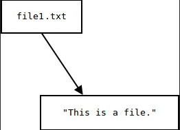
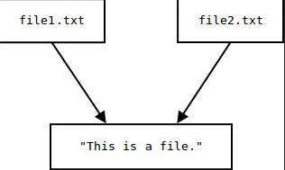
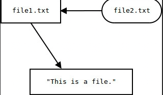

# Bash Basics

## Files
### File permissions
- Operacije oz. dovoljenja nad datotekami (drugacen pomen pri imenikih!!!)
    - `r` read
    - `w` write
    - `x` execute
    - `-` prazno

| __Znak__ | __Datoteka__ | __Imenik__ |
| - | - | - |
| `r` | read | izpis imenika |
| `w`| pisanje | spreminjanje |
| `x` | izvajanje | vstop v imenik |

- Sklopi uporabnikov
    - `u` - user
    - `g` - group
    - `o` - ostali
    - `a` - vsi
- Spreminjanje dovoljenj
    - `+` - dodajanje
    - `-` - odvzemanje
    - `=` - nastavljanje
- `chmod [augo][+-=]`

```bash
chmod u+x test.txt
chmod g+rwx test.txt
chmod o-rwx test.txt
```

- spreminjanje z binarno

```bash
chmod 775 test.txt
```

-  Change owner of a file and group

```bash
chown matevz test.txt
chgrp student test.txt
```

### Zascita datotek

#### Omejeno brisanje
- Restricted deleition
    - nastavimo za imenik, velja za vsebovane datoteke
        - datotteko v imeniku lahko odstrani le njen lastnik
- oznaka `t`
    - `chmod +t datoteka`

#### Setuid/setgid bit
- Omgoca zagon izvsljive datoteke z dovoljenji lastnika
- Oznaka s (sklop lastnik in skupina)
    - `chmod +s` datoteka

### Patterns
- Osnovni vzorci:
    - `*` - poljuben niz
    - `?` - poljuben znak
    - `[znaki]` poljuben znak iz danega nabora znakov

```bash
ls *.zip
echo b*.txt
echo b?.txst
ls ?2.txt f*
echo ???
ls ?
echo ?
echo c[[:digit:]].txt
echo [ac][13].*
echo [a-c][13].t?t
echo [a-c][13].t?t
echo [a-c]?[02].*xt
```
- Napredni vzorci
    - `?`(vzorci) - 0 ali 1 ponovitev
    - `*`(vzorci) - 0 ali vec ponovitev


## Terminal types
- `tty` is a regular terminal device (the console on your server for example)
- `pty` (pseudo terminal device) is a terminal __which is emulated__ by an other program (example: xterm, ssh, ...)
- `pts` is the slave part of pty

```bash
# open new terminal window
$ tty
/dev/pts/0
# open second terminal window
$ tty
/dev/pts/1
# on first terminal window write:

```

## Users
- Id stevilka uporabnika - `uid`
- Home directory of a user: `/home/user`
    - root: `/root`
- Changing user: `su user`
- Nastavitev gesla: `passwd`
- `last`, `lastb`
- izvajanje kot root `sudo`

### Groups
- identifikacija stevilka skupine - `gid`
- spisek skuping: `groups`
- informacije o uporabniku `id`
- zamenjava skupine: `newgrp`, `sg`


### etc/passwd
- podatki o userjih `/etc/passwd`
- Lahko pisemo na roke
    - `/usr/bin/nologin` uporabnikom prepovemo da se prijavijo v konzolo
```bash
oracle:x:1021:1020:Oracle user:/data/network/oracle:/bin/bash
Username:x-indicates-password-stored-in-/etc/shadow:UID:GID:User ID info:Home-directory:Command/shell
```

- Doajanja uporabnika
- ustavrjanje uporabnika: `useradd`
- odstranjevanje uporabnika: `userdel`
- spreminjanje uporabnika: `usermod`
- Kriptiranje gesla: `md5pass`, `sha1pass`, ...
```bash
u=s63000000
g=tezkogeslo
useradd -m -d "/home/student/$u" -s /bin/bash -g student -c "Student" $u
usermod -p $(md5pass "$g") $u
```

- dodajanje v grupo
```bash
sudo usermod -aG sudo user
```

### etc/shadow
- gesla shranjena v __hash__ obliki
- `/etc/gshadow`: group passwords


### Administracija skupin
- Nastavitev gesla: `gpasswd`
- Ustvarjanje skupine: `groupadd`
- Odstranjevanje skupine: `groupdel`
- Spreminjanje skupine: `groupmod`


## Sripting

### Special keyboard shortcuts
| Keybinding | Shortcut |
| - | - | 
| `Ctrl+c` | Interrupt/Kill process (SIGINT) |
| `Ctrl+z` | Suspend process (SIGSTP) |
| `Ctrl+d` | __EOF marker__, or close the current shelll |
| `Ctrl+r` | Reverse search |
| `Ctrl+l` | Clear screen |

### Useful commands

#### Shell history
```bash
history
histroy | grep ls
```

#### Stream editor - sed

| Descriptor | Usage |
| - | - |
| `p` | prints the line |
| `d` | deletes the line |
| `s` | substitues pattern and action |

##### Deleting lines
```bash
sed `4,10d` file    # Delete Lines [4,10 ]
sed `4,+5d` file    # deletes Lines [4,4+5]
sed `2,5!`  file    # Deletes all lines except range [2,5]
```

##### Printing lines
```bash
# Use the -n option to avoid repetiotion of line printing
sed - n`4,10p`         # Print lines [4,10]
```

##### Substitution
```bash
➜  ~/Faks/2_year/OS/vaje git:(main) ✗ cat text | sed 's/t/T/'
10 Tiny toes
This is that
5 funny 0
one Two three
Tree twice
```

- replace all occurances on each line: `sed s/<replace>/<with>/g`
```bash
➜  ~/Faks/2_year/OS/vaje git:(main) ✗ cat text | sed 's/t/T/g'
10 Tiny Toes
This is ThaT
5 funny 0
one Two Three
Tree Twice
```

### Special variables

| variable | function |
| - | - |
| `$_` | zadnji argument predhodno izvedenga ukaza |
| `$0` | ime skripte |
| `$1`,`$2`,...,`$n` | zaporedni argumenti skripte |
| `$?` | izhodni status zadnjega izvedenga ukaza |
| `$$` | PID lupine |
| `$!` | PID procesa, ki je bil zadnji zagnan v ozadju |
| `$*`, `$@` | Vsi argumenti skripte skupaj |
| `$-` | opcije podane lupini, ki poganja skripto |

### Exporting variables
Exported varaibles such as `$HOME` and `$PATH` are available to (inherited by) other programs run by the shell that exports them (and the programs 
run by those other programs, and so on) as __enviromental variables__. Regular (non-exported) variables are not avaliable to other programs.
- we find them by command `env`
- `$PATH`: tukaj bash isce ukaze (kje se nahaja)

```bash
$ env | grep '^variable='
$                                 # No environment variable called variable
$ variable=Hello                  # Create local (non-exported) variable with value
$ env | grep '^variable='
$                                 # Still no environment variable called variable
$ export variable                 # Mark variable for export to child processes
$ env | grep '^variable='
variable=Hello
$
$ export other_variable=Goodbye   # create and initialize exported variable
$ env | grep '^other_variable='
other_variable=Goodbye
$
```

Note that non-exported varaibles will be available to subshells run via `( ... )` and similiar notations because those subshells are direct clones
of the main shell.

```bash
$ othervar=present
$ (echo $othervar; echo $variable; variable=elephant; echo $variable)
present
Hello
elephant
$ echo $variable
Hello
$
```
The subshell can change its own copy of any variable, exported or not, and may affect the values seen by the processes it runs
,but the subshell's changes cannot affect the variable in the parent shell, of course.


### Linking
- `ln` createas a link to file 
- A __link__ is an entry in your file system which connects a __file name__ to the actual __bytes of data on the disk__. 

```bash
echo "This is a file." > file1.txt
cat file1.txt
```
When this file was created, the operating system wrote the bytes to a location on the disk and linked the data to a file name.



`Link` command: manually create a link to file data that already exists.

```bash
link file1.txt file2.txt
cat file2.txt
# This is a file.
```
- We did not make a copy of this data. Both file names point to the same bytes of data on the disk.



```bash
echo "It points to data on the disk." >> file1.txt
cat file2.txt
```
> If we delete one of the files, we're deleting only one of the links to the data but not the data.

#### Difference between ln and link
- `ln` byt default, creates a hard link like link does
```bash
ln file1.txt file2.txt
link file1.txt file2.txt
```
However we can also use `ln` to create sumbolic links with the `-s` option
```bash
ln -s file1.txt file2.txt
```
Creates a <u>symbolic link</u> (soft link): instead linking to the data of a file, they link to another link.


```bash
echo "This is a file." > file1.txt
ln -s file1.txt file2.txt
rm file1.txt
cat file2.txt
# 123

( a=456 )
echo $a
# 123
```

### Substiticija
```bash
echo ($ls) # primer ukaz izvedemo in tisto kar izpisejo upoarbimo naprej
echo Ime imenika: $(basename $(pwd))
```

### Preusmerjanje
- __standardni vhod__ (stdin: deskriptor 0)
- __standardni izhod__ (stdout: deskriptor 1)
- __standardni izhod za napake__ (stderr: deskriptor 2)


```bash
ukaz < datoteka         # preusmerjanje standardnega vhoda
ukaz > datoteka         # preusmerjanje standardnega izhoda
ukaz >> datoteka        # dodajanje

# splosno preusmerjanje
ukaz deskriptor>datoteka

# damo vedt da je deskriptor
cat spisek 1>2 #narobe
cat spisek 1>&2

# preusmeritev stderr (vrstni red preusmeritev je vazn)
ukaz 1>datoteka 2>&1
ukaz &>datoteka         # krajsi nacin

# preusmeritev naprav v "crno luknjo"
mkdir test 2>/dev/null

#  Podajanje programa na standardni vhod koncamo z podanimo locilom ('EOF')
cat <<'EOF' >skripta.sh
➜  python <<EOF
heredoc> print(1+2)
heredoc> EOF
3
```

### Cevovod
Vec ukazov
- `ukaz1 | ukaz2 | ukaz3 | ... | ukazN`

Izrezemo spisek vseh uporabniskih lupin
```bash
cat /etc/passwd | cut -d: -f7 | sort | uniq

# Koliko uporabnikov uporablja posamezno lupino po velikosti (prve tri)
cat /etc/passwd | cut -d: -f7 | sort | uniq -c | sort -nr | head -3

# Razvejitev cevovoda z ukazom tee
echo "JUHUHUHU" | tee izpis.text &>/dev/null

# xargs podajanje argumentov v cevovodu
echo 'one two three' | xargs mkdir
ls
# one two tree
```

### Conditional operators
```bash
# izhodni status
# - 0 true
# - 1 false

# ukaz1 && ukaz2 (nacin in)
false && echo "Se tole izpise"      # ne

# ukaz1 || ukaz2 (nacin ali)
true || echo "Se tole izpise?"      # ne

cd ~ && mkdir test && cd test && touch juhuhu.txt || echo "Tezave na vidiku"
```

### Zdruzevanje ukazov
- Uporabimo statement block `{ ukazi;... }`
```bash
mkdir test && { cd test; touch dat.txt; echo Zivjo; }
test -f /etc/passwd && { echo Imamo jo.; cat /etc/passwd; } || echo Napaka
```

### Aritmetika
- Uporabljamo dvojne oklepaje
    - `(( aritmetika ))`, `$(( aritmetika ))`

```bash
(( a = 1 + 2 * 3 ))
a=$(( 1 + 2*3 ))
(( b=a**a, a++, c = a + 1, a += 2 ))
(( a <= 12 )) && echo Malo || echo Veliko
echo $a $b $c $(( 42 * 24 ))
```

### Funkcije
- Definciija `function ime { ukazi }`
- Argumenti: `$1, $2, $3`
- Izhodni status namenjen da pove ali funkcija deluje pravilno
    - vracamo z <u>echo</u>
    - v bashu se vse vraca na standardni izhod
- Vrnjena vrednost v spremenljivki `$?`

```bash
function fakt1 {
    if (( $1 <= 1 )); then
        echo 1
    else 
        tmp=$(fakt2 $(($1 - 1)))
        return $(($1 * $tmp))
    fi
}
```

### Obnasanje funkcij in iteratorjev
- kot zunanji ukaz ki dobi na vnos __mojadatoteka.txt__
```bash
while read a; do 
    echo "$a"
done <mojadatoteka.txt
```

- array
```bash
studenti= ( Joze Mirko Miha Janez )
for stud in "$(studenti[@]}"; do 
    echo "$student"
Done
```

- niz
```bash
a=$'ena\ndva\ntri\nstiri'
while read line; do
    echo "$line"
done <<< "$a"
```


## System Calls
```bash
uname                                       # get name and information about current kernel
cd /proc                                    # mape kjer so podatki o procesih
cat cmdline                                 # BOOT_IMAGE=/boot/vmlinuz-4.4.0-38-generic         tukaj je shranjeno jedro
cat uptime                                  # podatki o sistemu
dmesg                                       # print or control the kernel ring buffer
```
